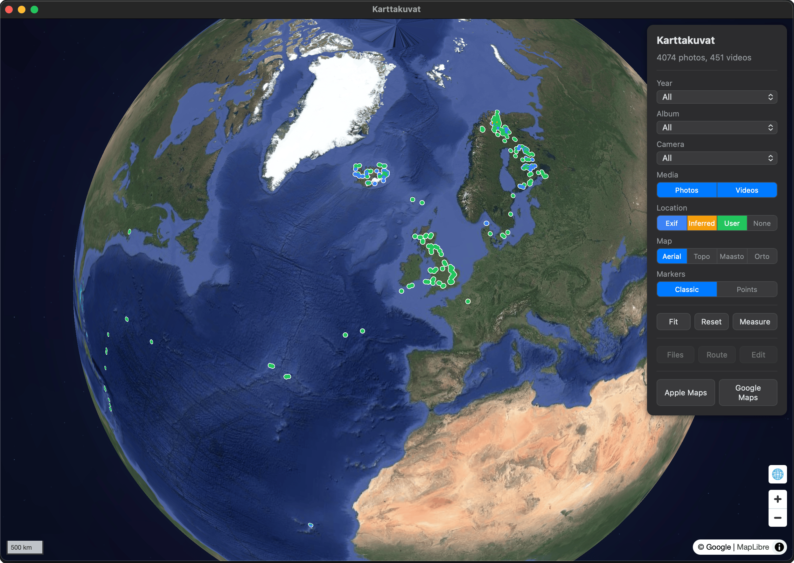

# Karttakuvat

Geolocation photo visualization app. Displays geotagged photographs from Apple Photos on an interactive map.



## Setup

Requires macOS, [Bun](https://bun.sh/), and Apple Photos with geotagged photos. Optional API keys can be added to `.env` to enable extra features:

```
PUBLIC_MML_API_KEY=your-key
PUBLIC_ORS_API_KEY=your-key
```

- Without `PUBLIC_MML_API_KEY` ([MML](https://www.maanmittauslaitos.fi/rajapinnat/api-avaimen-ohje)) the Maasto and Orto basemaps are hidden.
- Without `PUBLIC_ORS_API_KEY` ([OpenRouteService](https://openrouteservice.org/)) the Drive and Hike routing methods are hidden; Straight and None still work.

```bash
bun install
bun dev
```

To build and install to `/Applications`:

```bash
bun install:app
```

## Docs

- [App spec](docs/app.md) — current behavior
- [User flows](docs/flows.md) — interaction flows
- [Development diary](docs/diary.md) — project stats
